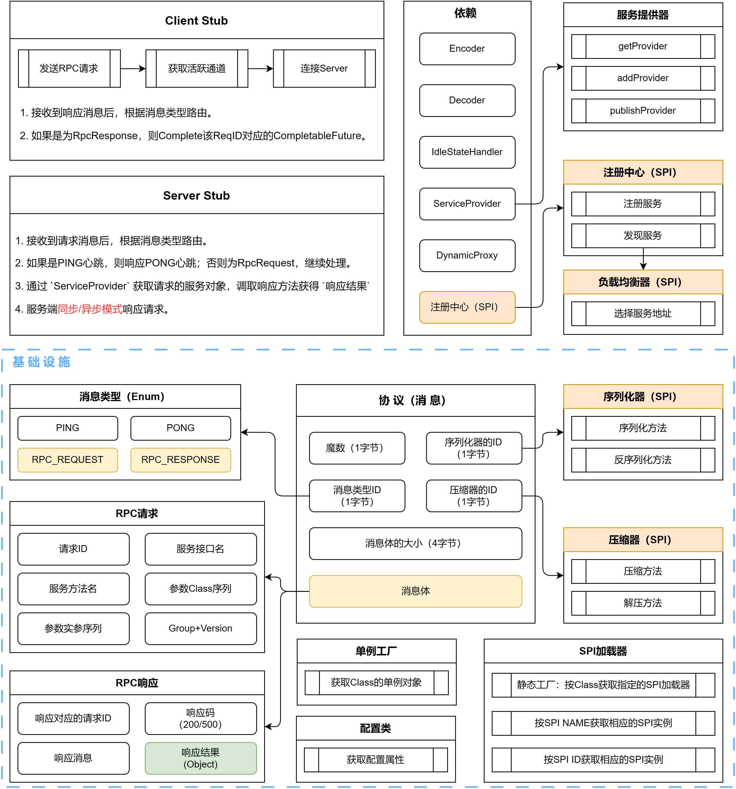

# X-RPC
X-RPC是一款基于Netty实现的**组件可扩展RPC框架**，灵活支持同步/异步模式。

_注：此项目是作者以学习为目的进行设计和开发的，如有漏洞，请及时联系我~_

## 亮点
- 设计并实现SPI机制，使得X-RPC的功能高度可扩展，(反)序列化器、(解)压缩器、负载均衡器、注册中心均可扩展。
- 同时支持`客户端(同步)-服务端(同步)`、`客户端(异步)-服务端(异步)`、`客户端(异步)-服务端(同步)`三种远程调用模式。

## 架构

## QuickStart
rpc-example提供了在服务端和客户端中使用X-RPC的案例，详见rpc-example中的rpc-server和rpc-client。